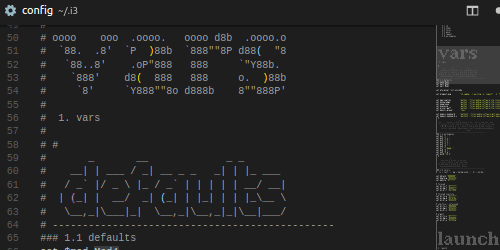
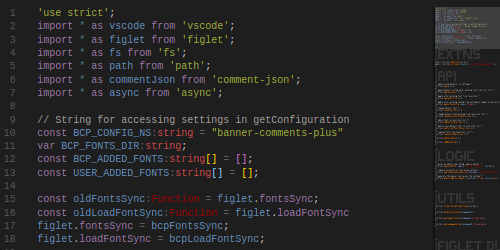
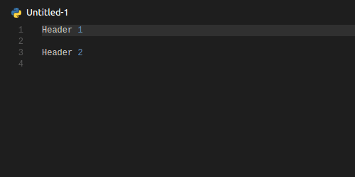
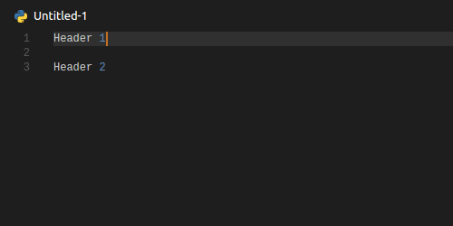
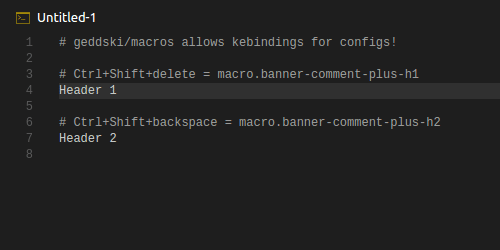
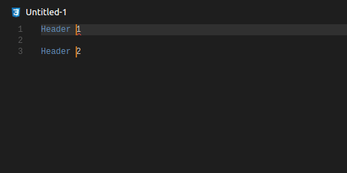

```
/*
         ____
        | __ )  __ _ _ __  _ __   ___ _ __
        |  _ \ / _` | '_ \| '_ \ / _ \ '__|
        | |_) | (_| | | | | | | |  __/ |
        |____/ \__,_|_| |_|_| |_|\___|_|
  ____                                     _
 / ___|___  _ __ ___  _ __ ___   ___ _ __ | |_ ___     _
| |   / _ \| '_ ` _ \| '_ ` _ \ / _ \ '_ \| __/ __|  _| |_
| |__| (_) | | | | | | | | | | |  __/ | | | |_\__ \ |_   _|
 \____\___/|_| |_| |_|_| |_| |_|\___|_| |_|\__|___/   |_|
*/
      credits: lunar_limbo, original author: IMFUZZ
```
Organize your code with large ASCII font comments to quickly idenfity your position in the file.

By harnessing the power of node-figlet and the many customizations of this extension, you can easily segment your code using comments. Works especially well with minimaps.

> _Improves upon IMFUZZ's work by adding more features and customization_

Deeply `customize` the output with prefix, suffix, perLinePrefix, and more. Use `commands` or `stored configs` to quickly add large banner comments using [figlet](https://www.npmjs.com/package/figlet). Using [geddski.macros](https://marketplace.visualstudio.com/items?itemName=geddski.macros) you can setup `keybinds` for your favorite configs

Play around with **over 275+** _mostly_ useless ascii fonts in this [sandbox](http://patorjk.com/software/taag/). 

**NEW!** Add your own .flf fonts for use with this extension. Create your own or download from the many sources online


# Features

- Will convert selection(s) or current line(s) into banner
- Use a default configuration or create multiple saved configs
- Setup keybinds for your favorite configs using [geddski.macros](https://marketplace.visualstudio.com/items?itemName=geddski.macros) ([instructions below](#macro-configuration))
- Deep customization: from Figlet's options, to comment styles, and even prefixes/suffixes

## Examples

### i3 configuration

  
Using two configurations,  
I can quickly identify  
sections of my config using  
the minimap and banner comments


### vscode extension

  
With code folding &  
banner comments  
parsing a code file is easy!


# Commands

## Apply - Converts selection or line into banner comment




## ApplyFromConfig - Convert selection or line using stored config




## Keybinds for configs - Apply configs with keybinds using [geddski.macros](https://marketplace.visualstudio.com/items?itemName=geddski.macros)



## Supports multiple selections



### Other commands

- **ApplyFromList** - select font before applying default config
- **ApplyFromFavorites** - select favorite font before applying default config
- **SetDefaultFont"** - set the default font from full list of fonts
- **SetDefaultFontFromFavorites"** - set the default font from favorites list
- **AddFontToFavorites"** - add a font to the favorites list
- **AddCurrentFontToFavorites"** - add current default font to favorites list
- **RemoveFontFromFavorites** - remove a font from favorites list
- **AddCustomFont** - add your own .flf font file to the available list
- **AddNewConfig** - create a new config using menus

## Extension Settings

- `font`: **<string\>** (name of Figlet font)
- `horizontalLayout`: **<string\>** ['default', full', 'fitted', 'controlled smushing', 'universal smushing']
- `verticalLayout`: **<string\>** ['default', full', 'fitted', 'controlled smushing', 'universal smushing']
- `trimTrailingWhitespace`: **<boolean\>** remove excess spaces at end of line?
- `trimEmptyLines`: **<boolean\>** remove lines with only spaces?
- `commentStyle`: **<string\>** How comments are used in the output ['block', 'line', 'both']
- `prefix`: **<string\>** string to place at beginning of result
- `suffix`: **<string\>** string to place at end of result
- `perLinePrefix`: **<string\>** string to place at beginning of each line
- `customFonts`: **<string[]\>** array of absolute file paths to other .flf fonts
- `configs`: **<object\>** object with named configs (all other settings combine to create one config)

### Figlet Settings

The figlet settings can be best understood by playing with [this tool](http://patorjk.com/software/taag/)

- `font`
- `horizontalLayout`
- `verticalLayout`

### Trim Settings

- `trimTrailingWhitespace`
  - to avoid lint traps
- `trimEmptyLines`
  - often, fonts have extra lines for descenders even when none in output
  - get rid of them to clean up your result
  - OR don't and keep each output unfirom

### Comment Style

Some languages don't have both styles of comments. Some langauges have different standards for how to use those comment styles. Take your pick.

- `block`: only use block style comment, but fallback to line comment if none
- `line`: only use line style comment, but fallback to block comment if none
- `both`: always put both block and line comments in output

### Fix Settings

These are rather straight forward. But remember these caveats:

1. perLinePrefix is applied to your prefix and suffix
2. Use \n to add newlines
3. perLinePrefix applied even without commentStyle line added

- `prefix`
- `suffix`
- `perLinePrefix`

# Macro configuration

1. install geddski.macros
2. write configs in settings file
3. write macro for config in settings file
4. create keybind

## 2. Write config(s)

``` json
    "banner-comments-plus.configs": {
        "h1": {
            "font": "Small",
            "horizontalLayout": "default",
            "verticalLayout": "default",
            "trimTrailingWhitespace": false,
            "trimEmptyLines": true,
            "commentStyle": "block",
            "perLinePrefix": " ",
            "prefix": "",
            "suffix": "--------------------------------------------------"
        }
    }
```

## 3. Write macro

The `args` value MUST match the `key` given to the config in your settings.

``` json
     "macros": {
        "banner-comments-plus-h1": [
            {"command": "banner-comments-plus.ApplyFromConfig", "args": "h1"},
        ]
    }
```

## 4. Create Keybind

``` json
    {
        "key": "ctrl+shift+delete",
        "command": "macros.banner-comments-plus-h1",
        "when": "editorTextFocus"
    }
```

# Requirements

None!

# Known Issues

- Only the languages provided by vscode are supported to wrap the banner with comments.
- Does not work with Markdown because of naming convention of extension from Microsoft
- Adding a config through menus, you cannot set prefix, suffix, or perLineSuffix to '' as this value is reserved to sumbit an empty string
-----------------------------------------------------------------------------------------------------------


<style>
    img { border: 1px dashed #666;}
    h3 + p { margin-left: 1rem;}
    #i3-configuration + p,
    #vscode-extension + p
     {
        display:flex;
        align-items: center;
        flex-wrap:wrap;
        flex:0 1 20%;
        /* vertical-align: "middle"; */
        /* border: 1px solid; */
    }
    #i3-configuration + p img,
    #vscode-extension + p img {
        height: 250px;
        margin: 0 1rem 0rem 0;
    }
</style>